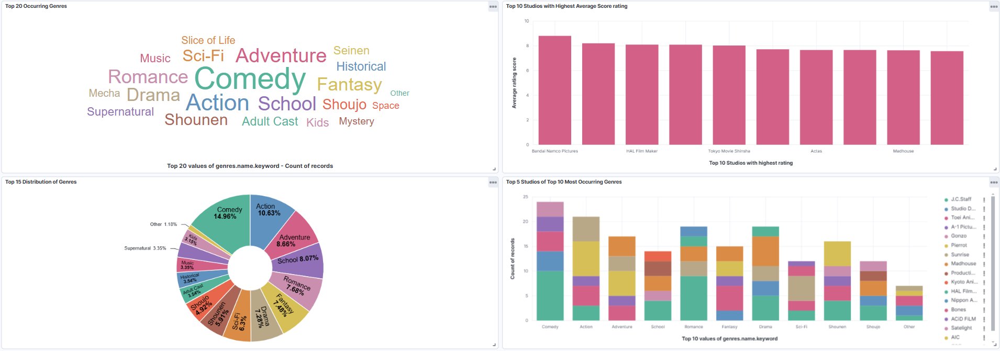
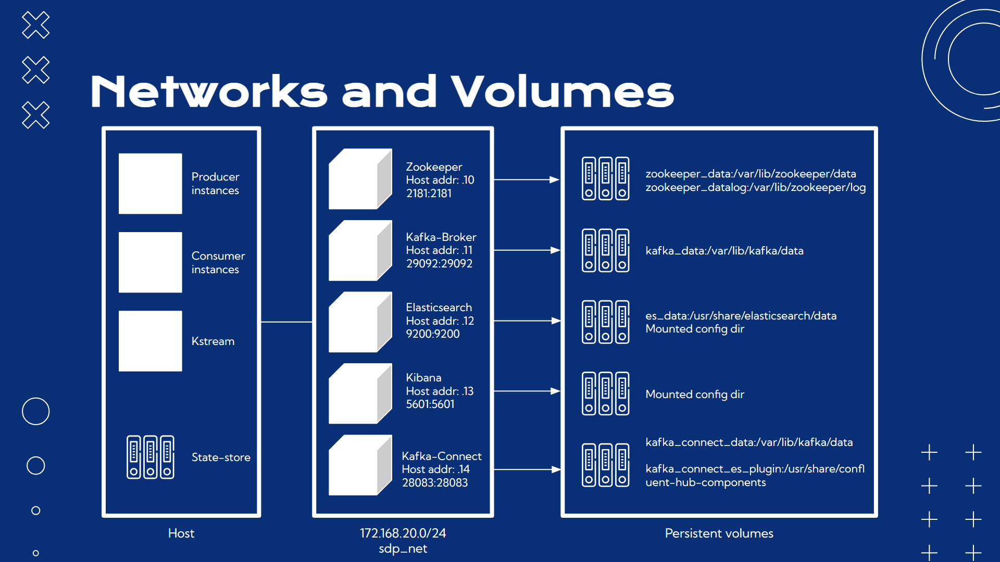

Contributor: Achira Laovong, Maythas Wangcharoenwong
# Streaming-Data-Pipeline
-----
### Overview
This repository aims to simulate data streaming pipeline using kafka as the message broker and then sent the data to elasticsearch which will then be visualized through Kibana, the raw data provided will be from MAL. We use maven as project management tool.

Kibana visualizations

-----

### Structure 
We used 5 containers in total which will be inter-connected via docker network:  
1. Zookeeper
2. Kafka-Broker
3. Elasticsearch
4. Kibana
5. Kafka-Connect

We will be using persistent volumes to store data for easy recovery. 

Docker connections structure (image template from slidesgo) 

-----

### Setting up
There are 2 steps in setting up the structure. 

1. Run `docker compose up -d` in `sdp` directory. 
2. To setup elasticsearch sink, please follow the instructon provided in `setup/sink_setup_instruction.md` 

----- 

### Data Pipeline structure

- Please use the specified application in CSVDataStream
- The content are stored under `/src/main/java/com/datastreaming/CSVDataStream` directory
- `CSVDataProducer.java` -> `CSVKStreamProcessor.java` which will then write to elasticsearch topic `es-anime-data`
- Explaination: This version uses Kstream model instead of the traditional Producer-Consumer model.
- `CSVDataProducer.java` is responsible for sending anime_id, title from the Kaggle dataset for `CSVKStreamProcessor.java` in which will calls APIs for more additional details and filter out explicit genres.
- The final data will be stored in Elasticsearch Index and will use Kibana to visualize live data.
- `CSVKStreamProcessor.java` utilize state stores and transactional messaging to avoid redundant API calls and ensure that the message are read exactly once.

-----

### Resources
  - The Client ID to call MAL API is stored in `src/main/resources/config.ptoperties` in which you will need to register for it.
  - The CSV Kaggle Dataset is stored in `src/main/resources/data/anime_filtered.csv`. The dataset can be downloaded at `https://www.kaggle.com/datasets/azathoth42/myanimelist`

  
-----

### Older Versions

\[Version 0\] Snippet for testing throughput 
- The content are stored under `/src/main/java/com/datastreaming/_SampleDatastreamTest` directory
- Explanation: This version simply create sample data payload in json format, pass value to an intermediate consumer for transformation / aggregation then passes them directly to elasticsearch sink which then passes to elasticsearch.
- `SampleDatastreamProducer.java` -> \[`SampleDatastreamConsumer.java`, `SampleDatastreamConsumerKstream.java`\] which will write to \[`sample-datastream-es`, `sample-count-es`\] accordingly. 

\[Version 1\]
- Please use the specified application in `/src/main/java/com/datastreaming/MALTopRaw` and `/src/main/java/com/datastreaming/AnimeDetails` directory
- This version uses traditional Producer-Consumer model. 
- `MALTopRawProducer.java` -> `MALTopRawConsumer.java` -> `AnimeDetailsConsumer.java` which will then write to elasticsearch topic `to-elastic-search`
- For this version, we uses MAL API to call 500 animes from Top Ranking Anime every call and extract anime_id, names for `AnimeDetailsConsumer.java` to get additional details from APIs to send to Elastic Search.

\[Version 2\]
- Please use the specified application in `/src/main/java/com/datastreaming/CSVDataStream`
- This version uses traditional Producer-Consumer model.
- `CSVDataProducer.java` -> `CSVDataConsumer.java` -> `CSVDataFamilyFriendlyFilter.java` which will then write to elasticsearch topic `es-anime-data`
- For this version, we uses Kaggle dataset and get anime_id, names for `CSVDataConsumeer.java` to get additional details from APIs. `CSVDataFamilyFriendlyFilter.java` will filter out explicit genres before sending to Elasticsearch Index.

